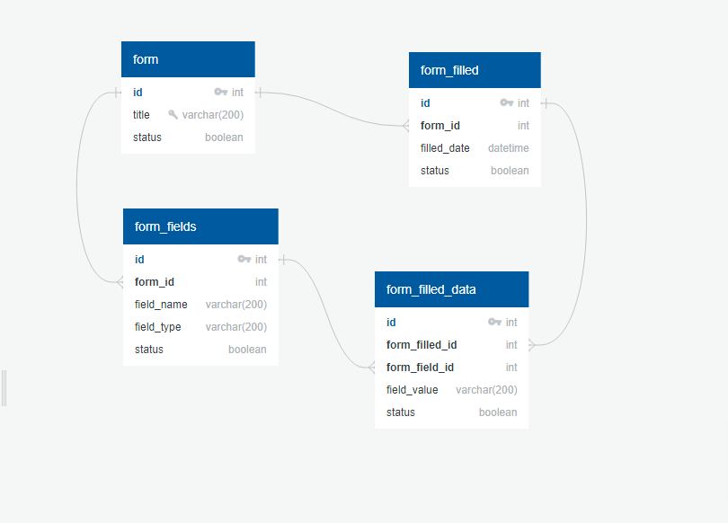

## Developed By

#### Name: Sujal Patel
#### Emp. Id: 715

## Nest.js Assessment

Create the three API routes as follows.


## Tools and Technology

|                  | Technology and Framework                  |
|------------------|-------------------------------------------|
| Technology       | Node.Js                                   |
| Framework        | Nest.Js                                   |
| Database         | MySQL                                     |
| ORM              | TypeORM                                   |


## Database Schema Design




## Highlighted Points
- Health check for API and Database using `@nestjs/terminus`
- Create a base entity abstract class for managing the common database fields.
- Managing the HTTP status code in the enum file.
- Create a common success and error message file.
- Fetch the record using OneToMany and ManyToOne relationship in entity file.
- For validation using class-validator.

## Installation

#### Step:1 Clone the Project
```bash
$ git clone https://github.com/sujalpatel2209/nestjs_assessment.git
```

#### Step:2 Install dependencies
```bash
$ cd nestjs_assessment

$ npm i OR npm install
```

## Running the app

```bash
# development
$ npm run start

# watch mode
$ npm run start:dev
```

## Project Understanding and Screenshots

### 1. There are four routes.
1. Get - /health (http://localhost:3001/api/v1/health)
2. POST - /form  (http://localhost:3001/api/v1/form)
3. POST - /fill_data?form_title="User" (http://localhost:3001/api/v1/fill_data?form_title=User)
4. GET - /fill_data?form_title="user" (http://localhost:3001/api/v1/fill_data?form_title=User)


### 2. Get - /health (http://localhost:3001/api/v1/health)

#### Response:


### 3. POST - /form (http://localhost:3001/api/v1/form)

#### Body:


#### Response:


### 4. POST - /fill_data?form_title="User" (http://localhost:3001/api/v1/fill_data?form_title=User)

#### Body:


#### Response:


### 5. GET - /fill_data?form_title="user" (http://localhost:3001/api/v1/fill_data?form_title=User)

#### Query Params:


#### Response:


